<!-- ⚠ 자동 생성: scripts/featureMap.ts(SSOT) → `npm run arch:render`. 직접 편집 금지. -->
# LANSMARK 기능 흐름 아키텍처 (지도)

> **단일 출처: `scripts/featureMap.ts`.** `npm run arch` 가 이 지도를 실제 코드와 자동 대조한다(어긋나면 빌드 실패).
> **🧭 지시·코딩을 시작하기 전, 반드시 이 지도를 먼저 본다.** 새 기능/엔드포인트/파일은 featureMap에 등록할 것.

```mermaid
flowchart LR
  assess["🧭 귀농 자가진단(앞단 깔때기)<br/>귀농 자가진단(자금·동기·경험·가족·농지)"]
  land["🗺 땅 선택·토지유형<br/>지도·필지 선택<br/>토지유형 분류(강·바다·도시·농경지)"]
  assess --> land
  recommend["🌱 무료 작물추천·전환<br/>작물 시장 정렬 표(crop-first 진입)<br/>작물→지역 추천(기후 적합)<br/>무료 작물추천<br/>지원금·지자체·농협 혜택<br/>기후 근거(필지 기후 프로필)<br/>작물 전환 로드맵(온난화 재결정)"]
  land --> recommend
  pay["💳 결제·유료권한<br/>결제·유료권한"]
  recommend --> pay
  simulate["📊 정밀 소득·예산·온난화<br/>정밀 소득 시뮬(P10/50/90)<br/>예산·정착비용·현금흐름 계획기<br/>지구온난화 시나리오(기후변화 가정)"]
  pay --> simulate
  growth["🌿 생육·출하<br/>생육·출하 타임라인<br/>재배 가이드·품종 선택"]
  simulate --> growth
  operate["🌾 재배 운영·동반(기록·모니터링·알람·출하)<br/>재배 기록·시즌 리포트<br/>일일 환경 모니터링·시각화<br/>데일리 브리핑(오늘 내 농장)<br/>병충해·재난 알람<br/>알림 구독(opt-in 핸드폰)<br/>웹푸시 알림(앱 푸시·SMS 대체)<br/>출하 시세·납품처 최적화"]
  growth --> operate
  act["🤝 행동 연결(판로·자금·종자)<br/>판로·계약 연결(직거래·수매·계약재배)<br/>자금·정책자금 연결(매칭·자격판정·신청)"]
  operate --> act
  feedback["🔁 실측 보정(해자)<br/>실측 보정 플라이휠(해자)"]
  act --> feedback
  subgraph PLATFORM["⚙ 플랫폼·운영 (cross-cutting)"]
    b2b_consulting["B2B 컨설팅 패키지(기관·라이선스)"]
    ops_console["운영자 콘솔"]
    demand_analytics["익명 수요·퍼널 계측"]
    data_quality_gate["데이터 품질 게이트(신뢰 피쉬본)"]
    ops_watcher["Tier 1 ops watcher(읽기·진단)"]
    client_error_telemetry["클라이언트 에러·환경 진단 텔레메트리 (자동 관측·추적·가이드)"]
    backup_restore["백업·복구·감사내보내기"]
    provider_dropin["실연동 provider(드롭인)"]
    integrations_seam["외부연동 준비(HUMAN GATE)"]
    security["보안 미들웨어"]
    user_account["계정·세션(가입 + 익명→계정 이관)"]
    persistence["영속성(memory↔file↔firestore)"]
    versioning["버전·변경점 팝업"]
    session_io["저장·불러오기·공유·PDF"]
    server_core["서버 오케스트레이션"]
    pwa_shell["PWA(설치형 모바일 앱)"]
  end
  PLATFORM -. 뒷받침 .-> simulate
```

## 기능 상세 (단계별)

### 🗺 땅·토지유형

| 기능 | 흐름 | 엔드포인트 | 파일 | 테스트 | 상태 | 비고/seam |
|---|---|---|--:|--:|---|---|
| **지도·필지 선택** | 지도 탭/주소검색 → 줌단계(전국/시군/필지) → 핀·필지 선택 → 실엔진 조회 | `/api/config` `/api/geocode` `/api/parcel` `/api/terrain` | 7 | 4 | 🟢 live | geocode/parcel/타일 live · 지형=Open-Meteo 실측(무키·~90m·실패 시 mock 폴백·⚠비상업 티어=상업 전환 시 Google Elevation 등 교체) |
| **토지유형 분류(강·바다·도시·농경지)** | 좌표 → 분류(group/action) → 차단(수면)·경고(도시)·재확인(기존농경지) | `/api/landclass` | 2 | 1 | 🟡 mock | live=VWorld 지목→classifyJimok seam |

### 🌱 무료추천

| 기능 | 흐름 | 엔드포인트 | 파일 | 테스트 | 상태 | 비고/seam |
|---|---|---|--:|--:|---|---|
| **작물 시장 정렬 표(crop-first 진입)** | 처음 사용자 '뭘 키울지' → 정렬 표(순서·작물·난이도·트렌드·단가·차별화·기본=트렌드순) → 작물 선택(→region-discover 적합지 녹/적) | `/api/crop-trend` | 3 | 2 | 🟢 live | crop-first 정렬 표(작물 고르기 전). 컬럼 출처 분리 — 난이도=재배 요구조건 룰(S1b)·단가=crops.seed 실값·트렌드/차별화=Perplexity Sonar 3단계(1~3·정밀순위 금지)·citations 필수. fetchMarketSignals 주기캐시(TTL 30일)+callBudget. ⛔ PERPLEXITY_API_KEY=HUMAN GATE(없으면 signals:null·기존 '땅먼저' 폴백). 라우트=server/routes/market.ts(cropTrendRoutes·harvest-market과 동거). 표 조립(S1c)·색막대 게이지 UI(S2)·녹적지도(S3) 후속. |
| **작물→지역 추천(기후 적합)** | 작물 선택 → 추천 지형조건(요구조건) + 시도별 기후 적합(적합/주의/부적합) · 시도 중심좌표(지도 마커 다음) | `/api/region-fit` `/api/sido-geo` | 4 | 1 | 🟢 live | 역방향 탐색(작물→어디서). 시도 평년기후(근사·KMA 평년 seam) × field-monitor 로직 재사용 · 무료 · 시도 중심좌표 포함(지도 마커 다음 단계) · 온난화 시나리오(year/path/dt → ΔT)로 현재↔미래 적합 이동 제공(KMA SSP 근사·외삽·미검증) · ⚠ 전국 고해상 적합 히트맵은 비구현(전국 기후·지형 그리드 필요) |
| **무료 작물추천** | 필지 → 적합도 상대점수 작물후보(무료·매입추천 아님) + 전체 작물 카탈로그(추천 밖 작물 직접 선택) | `/api/recommend` `/api/crops` `/api/retail-price` | 6 | 4 | 🟢 live | — |
| **지원금·지자체·농협 혜택** | 지역·작물 → 대표 지원 제도(정부/지자체/농협) 안내 + 공식 확인 경로 + 작물 관련도 | `/api/support` | 3 | 2 | 🟢 live | Phase A: 대표 제도 큐레이션(공개 사실)+공식 확인 경로 · 무료 · ⚠ 공공데이터포털 농림사업·지자체 보조·농협 혜택 실시간 큐레이션은 Phase B seam(데이터 운영=HUMAN GATE) |
| **기후 근거(필지 기후 프로필)** | 필지/지점 → KMA 실측 기후(연평균기온·적산온도GDD·강수·겨울최저·여름최고·일조) → 평이한 '기후 근거' 문장 + 출처(평년값 아님)·면책 | — | 1 | 1 | 🟢 live | 데이터=최근접 ASOS·최근 1년(평년값 아님). **노출 완료**: /api/recommend 응답에 climateEvidence 합류(analysis.ts) → 대시보드 추천 카드 '🌤 이 땅 기후 · 추천 근거' + 지도 핀 팝업(lansmark_app.html). 별도 엔드포인트 미생성=의도적 UX(추가 호출 회피·version.ts). ⚠ 전국 색지도·작물별 GDD 충분/부족 판정은 KMA 격자 평년값 + 농진청 작물 base 확보 후(HUMAN GATE). |
| **작물 전환 로드맵(온난화 재결정)** | 현재 작목 + 온난화 시나리오 → '지금 사과 → 2050엔 ○○' 전환 후보·시기 → 재방문/재결정 트리거(저빈도 보완) | `/api/crop-transition` | 2 | 1 | 🟢 live | climate-scenario(applyWarming)×cropSuitability(rankCropCandidates) 합성 — 현재·2040·2060 시점별 적합 작물 + newcomers/fadeouts. /api/crop-transition. 차별점(경쟁앱 부재)·B2B/지자체 PR. ΔT=KMA/IPCC 근사 demo(외삽·SSP2-4.5). UI 노출은 추후 슬라이스(필지 카드). |

### 💳 결제·권한

| 기능 | 흐름 | 엔드포인트 | 파일 | 테스트 | 상태 | 비고/seam |
|---|---|---|--:|--:|---|---|
| **결제·유료권한** | 결제(Toss/PayPal/데모) → 서버권위 금액검증 → HMAC 엔티틀먼트(jti·quota·exp) → 정밀분석 잠금해제 | `/api/pay/mock` `/api/pay/confirm` `/api/pg/webhook` `/api/pay/paypal/create` `/api/pay/paypal/capture` `/api/pg/paypal/webhook` | 7 | 5 | 🟢 live | PG 2종 스위칭: Toss(confirm+webhook 실구현) · PayPal(REST v2 orders·fail-closed·키 HUMAN GATE) · 활성 전환은 ops PG 스위칭(키 완비 PG만). 데모(mock)는 키 전무·비운영 한정 |

### 📊 정밀시뮬

| 기능 | 흐름 | 엔드포인트 | 파일 | 테스트 | 상태 | 비고/seam |
|---|---|---|--:|--:|---|---|
| **정밀 소득 시뮬(P10/50/90)** | 유료게이트 → 입력검증 → 보정조회 → 엔진(P10/50/90·6축·손익분기·신뢰도·면책) | `/api/simulate` | 9 | 6 | 🟢 live | ⚠ 파이프라인 live · 소득 base=RDA 데모(verified:false) — **실자료 파이프라인 사전 구축 완료**: 농진청 소득조사 CSV → `npm run rda:build <csv>` → rdaIncome.real.ts 재생성 → getRdaBase 실값 우선(verified:true·연도·출처 표기). 자료 수령=HUMAN GATE · 가격=KAMIS(apple만 검증) · 지구온난화 ΔT(climateScenario): 시설 냉난방·냉량성 고온페널티 반영(데모·외삽) · heatTolerance 정밀화는 seam |
| **예산·정착비용·현금흐름 계획기** | 초기투자(시설·관수 시드±override)+융자(원리금균등)+보조 → 다년 현금흐름(3시나리오 P10/50/90)·회수기간(payback)·ROI·손익분기 · 무료=단년 회수 미리보기/유료=다년 정밀 | `/api/budget` | 4 | 3 | 🟢 live | parcelSimulator 미수정(incomeKrw/costKrw 주입 wrap · 유료 로직은 정밀엔진에만) · 다년 percentile=일관 시나리오 경로(분포 합성 아님 — 비관=저소득+고비용) · 시설 capex 시드=2025 시장조사 참고치(verified:false·평당 환산) · 융자/보조 금액·금리 단정 안 함→support.seed(nh_fund/smartfarm/young_farmer) 링크 · ⚠ 시설 소득팩터·IoT 환경제어는 범위 밖(seam) |
| **지구온난화 시나리오(기후변화 가정)** | 연도·배출경로(SSP) 또는 직접 ΔT → 온난화 폭 ΔT(℃) 산출 → 평년 기후에 적용(겨울최저↑·서리 완화) → 추천(무료: 현재↔미래 적합 이동)·정밀시뮬(유료: 시설 냉난방·고온 페널티) 공통 구동 | — | 1 | 1 | 🟢 live | 순수·결정적 프리미티브(warmingDeltaC/applyWarming) — region-discover(무료 현재↔미래 적합)·precise-sim(유료 미래 소득·시설비) 공유 횡단 가정. 온난화율=기상청 「한반도 기후변화 전망보고서」 SSP 근사(demo·verified:false·외삽·선형) · 적용: 겨울최저·여름최고 +ΔT(고온 스트레스)·연강수 평균 소폭↑(℃당~+1.5%·상한+12%)·서리 완화 — 강수 '변동성'(집중호우·가뭄)·일조는 결정적 미반영(리스크노트) · ⚠ KMA 격자 연동 시 비선형·지역차 정밀화(seam) |

### 🌿 생육·출하

| 기능 | 흐름 | 엔드포인트 | 파일 | 테스트 | 상태 | 비고/seam |
|---|---|---|--:|--:|---|---|
| **생육·출하 타임라인** | 작물 → 파종·생육·개화·수확(12개월) + 출하 적기 + 생육 리스크(기상·병해충) | `/api/simulate` | 3 | 3 | 🟢 live | canonical /api/simulate 응답에 growth로 합쳐 노출 |
| **재배 가이드·품종 선택** | 작물 → 품종 후보 + 재배 환경 요구조건(pH·배수·물·일조·내한·서리·경사) + 재배 적기·리스크 · 무료=대표작물/유료=전체 | `/api/guide` `/api/foreign` | 5 | 6 | 🟢 live | Phase A(국내): 룰북 품종·요구조건·캘린더 + **농사로 e-book 링크아웃**(cropEbook 라이브 실증 결과 구조화 데이터가 아닌 전자책 파일 반환 → 심층연동 대신 농진청 공개 포털로 외부 링크가 정직·저비용) · 무료 STAPLE_FREE/유료 전체. Phase B(외래·임의 착수): /api/foreign = GBIF 분류 + 위키백과(ko) 설명 실연동(키 불필요·유료·⚠소득시뮬 비활성) · 기후적합성 매칭 · **Perplexity Sonar AI 재배요약 live**(perplexity.ts: 외래작물 한정·정량수치 프롬프트 차단·citations 동반·하드라벨 '검증필요/보장아님'·24h 캐시·키없으면 null 무중단) · Trefle/Perenual·OpenFarm은 추가 seam · 벼·보리 시드 미수록(후속) |

### 🌾 재배운영·동반

| 기능 | 흐름 | 엔드포인트 | 파일 | 테스트 | 상태 | 비고/seam |
|---|---|---|--:|--:|---|---|
| **재배 기록·시즌 리포트** | 재배 시작(시뮬 예측 결속) → 작업·수확 기록 → 시즌 리포트(투입·수확·수익·예측대비) · 수확→플라이휠 승격(해자) | `/api/journal` `/api/journal/event` `/api/journal/harvest` `/api/journal/report` `/api/journal/delete` | 4 | 2 | 🟢 live | 영농 동반 1번 슬라이스(buildable-now) · FileJournalStore(재시작 보존) · 수확 실측이 해자 데이터로 자동 환류(actualCost는 부분원가라 미전송) · FileJournalStore는 persistence(db/stores.ts) 소속 |
| **일일 환경 모니터링·시각화** | 필지 좌표·작물 → 기후(강수·겨울최저·일조·서리) vs 작물 요구 적합 점검(ok/주의/위험) | `/api/monitor` | 3 | 2 | 🟢 live | Phase A: KMA 기후 요약 vs 작물 요구조건 적합 점검 · 무료·sensitive RL · ⚠ 일일 실측·필지별 시계열·자동 알림(인앱/푸시)은 Phase B seam(수집 cron+인프라) |
| **데일리 브리핑(오늘 내 농장)** | 재배중 일지(=내 농장) → 7일 예보(Open-Meteo 무키)×작물요구 위험 매칭(서리·폭염·호우·강풍·건조) + 생육단계·오늘 할 일 + 병해충·KMA특보·시세 → 홈 브리핑 + 아침 웹푸시(관리자/크론 트리거) | `/api/briefing` `/api/ops/push-briefing` | 4 | 4 | 🟢 live | 신원=journal requireEnt 공유(무료베타 익명 격리) · 농장 상한 3(외부호출 가드)+예보 30분 캐시 · 예보=Open-Meteo(무키·⚠비상업 티어 — 상업 전환 시 KMA 단기예보 교체 seam) · 아침 발송=/api/ops/push-briefing(관리자 토큰·1회 500건 상한·만료 구독 파기) — 매일 아침 크론 호출은 Cloud Scheduler(HUMAN GATE) · ⚠ 유료 모드 결제-계정 결속 전엔 무료베타 신원에서 정합 |
| **병충해·재난 알람** | 작물·월 → 병해충(룰북)+기상/재해(계절 농학) 주의 + 현재월 매칭 · region 주면 KMA 실시간 기상특보 합류(live) | `/api/alerts` | 4 | 3 | 🟢 live | 작물·월 병해충(cropPests.seed)+기상/재해(룰북) · **KMA 기상특보 live**(kmaWarning: EUC-KR·typ01·60초 캐시·키없으면 []) · **NCPMS 주요 병해충 live**(ncpms SVC01 작물명 검색→JSON 이름 칩·중복제거·작물명 미매칭 시 [] 무중단·이미지는 http라 제외) · 푸시는 Phase B |
| **알림 구독(opt-in 핸드폰)** | 자체 팝업(동의+휴대폰 번호) → 동의·번호 저장(PII) → (발송은 SMS 제공자 seam). VAPID 웹푸시 대체. | `/api/alerts/subscribe` `/api/alerts/unsubscribe` | 4 | 1 | 🟢 live | 저장만 live · 실제 SMS 발송은 smsSender seam(한국 SMS 게이트웨이 키=HUMAN GATE) · FileSubscriptionStore=persistence(db/stores) 소속 · ⚠ PII at-rest 암호화는 운영 hardening seam · 무과금 채널은 web-push로 승격(사용자 선택: SMS 과금 회피) |
| **웹푸시 알림(앱 푸시·SMS 대체)** | 알림 모달/브리핑 홈 '알림 받기' → /api/push/vapid(configured?) → 권한 요청 → SW pushManager.subscribe → /api/push/subscribe(구독 저장) → 발송(LiveWebPushSender: RFC 8291 aes128gcm+RFC 8292 VAPID) → SW push 이벤트가 알림 표시·클릭 시 앱 포커스. | `/api/push/vapid` `/api/push/subscribe` `/api/push/unsubscribe` | 3 | 2 | 🟢 live | 발송 승격(2026-07): 무의존 직접구현 — RFC 8291 공식 테스트 벡터 바이트 일치 검증(webPushSender.spec) · VAPID 자가생성=npm run vapid:gen → env 주입(HUMAN GATE) · 만료 구독(404/410) 자동 파기 · 아침 브리핑 발송=/api/ops/push-briefing(daily-briefing 소속) · 구독 영속(File store)=follow-up |
| **출하 시세·납품처 최적화** | 작물 → KAMIS 실도매가 앵커 + 판로별(도매/직거래/혼합/가공/체험) 기대 단가·도매 대비% 비교 → 최적 납품처 | `/api/market` | 2 | 2 | 🟢 live | 판로 '비율'=룰북(데모) + 도매 '실시세'=KAMIS live 앵커로 레벨링 · 무료(가입훅) · KAMIS 미검증 품목은 seed 폴백 · ⚠ 시장별·등급별 세분화는 seam(KAMIS kind/rank 파라미터 검증 후) |

### 🔁 실측보정(해자)

| 기능 | 흐름 | 엔드포인트 | 파일 | 테스트 | 상태 | 비고/seam |
|---|---|---|--:|--:|---|---|
| **실측 보정 플라이휠(해자)** | 실측 제출(유료게이트) → 작물·지형버킷 보정 → Dream 정리 스냅샷(이상치격리·recency·버킷승격·TTL캐시) → simulate가 정밀보정 사용 → validated(서로 다른 제출자 5↑) | `/api/feedback` | 5 | 4 | 🟢 live | ★ B2C→B2B 다리: B2C 사용(일지 수확·실측 제출)이 작물·지역버킷 보정을 쌓아 demo를 실측으로 대체 → validated 누적이 곧 B2B(객관 근거 판매)의 전환 게이트. B2C 단계의 '실측 제출 인센티브'가 해자·B2B의 연료. |

### 🛠 운영콘솔

| 기능 | 흐름 | 엔드포인트 | 파일 | 테스트 | 상태 | 비고/seam |
|---|---|---|--:|--:|---|---|
| **B2B 컨설팅 패키지(기관·라이선스)** | 농업기술센터·귀농지원센터·컨설턴트가 상담 도구로 사용(객관 근거 P10/50/90·면책) → 기관 라이선스(저빈도·계절성·접근성 우회) | — | 0 | 0 | 🟠 seam | ⏱ Phase 2(전략: B2C 먼저 → 데이터 축적 후). 전환 게이트 = 플라이휠 validated(서로 다른 제출자 5↑) 작물·지역버킷이 일정 수 누적 → demo가 실측으로 대체돼 '객관 근거'가 설 때 기관 판매. 개인 저빈도·디지털약자·계절편중을 '기관 반복 사용'으로 우회 — 반복(구독)수익 축. 권위 협력(농진청·지자체) 결합 시 강력. |
| **운영자 콘솔** | 통합 준비도·결제·플라이휠·활동로그 + 관리자 인증 + 토큰 실효(revoke) + 유료 게이트 런타임 토글(무료베타↔유료) + PG 스위칭(Toss↔PayPal) + CI 상태(GitHub Actions) | `/api/ops/stats` `/api/ops/revoke` `/api/ops/paid-gate` `/api/ops/pg-preference` `/api/ops/ci` | 4 | 3 | 🟢 live | — |
| **익명 수요·퍼널 계측** | 무료 베타 익명 사용자의 수요(시뮬 작물×지역)·퍼널(추천→시뮬→가이드/외래→일지→옵트인)·데이터갭을 서버측 집계(PII 0)로 잡아 /api/ops/stats·운영콘솔에 노출 — '무엇을 얻는가' 가시화(Phase A) | — | 2 | 1 | 🟢 live | Phase A. 기존 라우트(recommend/simulate/guide/foreign/journal/subscribe) 성공 시점에 집계 호출 — 새 공개 엔드포인트 0(스팸·poison 표면 최소). 지도 탐색·이탈(클라 비콘)은 공개 ingress라 A.2로 분리. 발송 리마인드(slow loop)는 SMS seam·HUMAN GATE. |
| **데이터 품질 게이트(신뢰 피쉬본)** | 운영 녹색과 별개로 '넘기는 데이터가 검증/정직한가'를 차원별 게이트(ok/warn/fail)로 평가 — 기존 신호 집계(integrationReadiness·RDA_REAL_META·flywheel). OPS 종합에 신뢰 피쉬본(머리=등급/verdict·뼈=원인별 색) + 제품 자동 보수(base 미검증이면 앱 '✓검증' 차단·'추정' 강제). /api/ops/stats.quality 노출 | — | 1 | 1 | 🟢 live | v1=린(소스 live↔mock·base 검증·DEM·보정 게이트). 탐지형(통합 live) vs 구조형(RDA 데모·DEM REST 미제공) 구분. 후속: 값-범위 sanity·신선도/스키마 게이트, Tier 1 ops watcher(읽기·진단·호출)가 이 quality를 소비. |
| **Tier 1 ops watcher(읽기·진단)** | 읽기 전용 감시자 — /api/ops/stats(품질 게이트·최적화 트리거·스토어 저하·5xx)를 읽어 crit/warn/ok로 롤업 + 평문 진단·권고. 채널 무관(stdout+exit code) → cron·GitHub Action·Claude Code 루틴이 얇게 래핑(슬랙·이메일·푸시). 행동권 0(Tier 2는 신뢰 번 뒤 별도). | — | 1 | 1 | 🟢 live | CLI=scripts/opsWatch.ts(npm run ops:watch · env LANSMARK_BASE·LANSMARK_ADMIN_TOKEN). exit 0=ok/1=findings/2=접근오류. Tier 2(좁은 가역 자동행동·킬스위치)는 신뢰 검증 후·별 슬라이스. |
| **클라이언트 에러·환경 진단 텔레메트리 (자동 관측·추적·가이드)** | ① JS 에러: 브라우저 uncaught 에러/거부를 POST /api/client-error로 수집. ② 환경 진단(에러를 '사용자 설명 의존'→'앱 자동 관측'으로 전환): 앱 부팅 시 자기 상태(SW상태·직전 오프라인·콜드스타트·뷰포트·캐시버전)를 POST /api/client-diag로 익명 자동 보고 → window.onerror로 안 잡히는 '먹통/SW갇힘/연결실패'를 관측(OFFLINE_HTML이 localStorage 플래그를 남기면 다음 정상 로드가 자동 보고). 둘 다 집계·PII 0·'새 distinct/임계'만 활동로그+웹훅. /api/ops/stats.{clientErrors,clientDiag}로 콘솔 '서버' 탭 + watch 노출. ⚠ 관측/추적/가이드 전용 — SW unregister·캐시삭제 같은 복구는 절대 자동으로 안 함. | `/api/client-error` `/api/client-diag` | 3 | 2 | 🟢 live | 에러를 '사용자 설명 의존'에서 '앱 자동 관측 → 운영자 추적 → 가이드(점검 권장)'로 전환. 가이드는 텍스트 안내일 뿐 자동 조치 없음. 메모리 보관(재시작 휘발). 프론트 리포터=dashboard/lansmark_app.html(client-error 세션상한 8 · client-diag 부팅 1회 비콘). |
| **백업·복구·감사내보내기** | 관리자: ① 백업/복구 — lm_state 문서/.data 파일을 불투명 바이트(암호문 그대로)로 스냅샷 → 별도 위치(lm_backups / .data/backups) 보관·목록·복구(confirm 타이핑·pre-restore 자동·재시작 유도) ② 감사 내보내기 — 카테고리 선택 → 복호 평문을 zip(의존성0)으로 다운로드(세션·시크릿 제외·PII 라벨). ops '🛟 백업/복구' 탭 | `/api/ops/backup` `/api/ops/backup/status` `/api/ops/backup/restore` `/api/ops/export` | 7 | 3 | 🟢 live | Layer1=앱레벨 같은-DB 스냅샷(운영 실수·논리 손상 복구·되돌리기). 같은 DB라 진짜 DR 아님 — 프로젝트/DB 전체 손실은 Layer2(GCP 관리형 PITR 7일+일일 스케줄 백업·gcloud·HUMAN GATE)가 담당. ops 백업 탭에 DR 한계 상시 라벨. 1MiB per-store 개별 문서. 감사내보내기=복호 평문 zip(감사 제출용). |

### ⚙ 플랫폼

| 기능 | 흐름 | 엔드포인트 | 파일 | 테스트 | 상태 | 비고/seam |
|---|---|---|--:|--:|---|---|
| **실연동 provider(드롭인)** | 키 있으면 통합별 live, 없으면 mock 폴백(무중단) · 형태가드로 조용한 오염 차단 | — | 10 | 6 | 🟢 live | geocode/parcel/KMA/KAMIS·지형(Open-Meteo) live · RDA seam · pick()이 연동별 live/폴백 집계(runtimeHealth) → ops 정직 표시 · 외부조회는 격자/작물 TTL 캐시(cache.ts)로 재사용(반복분석 외부호출 절감) |
| **외부연동 준비(HUMAN GATE)** | 키 꽂으면 live·없으면 unconfigured — 특보·예찰·식물정보·지원금·푸시·크론·AI설명의 URL·키게이트·파서가드(SHAPE_UNVERIFIED) 준비층 · 발급절차=HUMAN_GATE.md | `/api/explain` | 10 | 3 | 🟠 seam | 준비층(listIntegrations 8종 추적) — 미승격 seam: NCPMS(키)·농사로 국내(키·HTTP실측)·Perenual/Trefle 외래(키·무료=분류뿐)·data.go.kr 지원금(serviceKey)·VAPID 푸시·크론. **KMA 특보·AI설명(ai-explain)은 live 승격으로 졸업**. AI설명 = POST /api/explain(유료게이트+sensitive 레이트리밋·verified 승격 2026-06-19: 라이브 실응답 캡처+출력가드(만/억 환산 정규화)+인젝션 레드팀 3/3·UI는 배포·데이터 뒤) — 가드는 docs/AI_SECURITY.md. 나머지 실응답 파서는 키 확보 후 한 슬라이스씩 승격(SHAPE_UNVERIFIED 해제) · 발급=HUMAN_GATE.md |
| **보안 미들웨어** | 요청 진입 → 보안헤더·CSP·CORS·레이트리밋(IP 신뢰경계) · 부팅 fail-closed | — | 4 | 4 | ⚙ platform | — |
| **계정·세션(가입 + 익명→계정 이관)** | 익명(기기)→가입(아이디/비번[발송0·가벼움] 또는 휴대폰 OTP·이메일 매직링크)→계정(acct:Z)·세션. CompositeVerifier가 method로 라우팅. 로그인 시 일지를 계정 신원으로 귀속, link-anon이 기존 익명 일지를 계정으로 이관(재시작 보존). 이메일 매직링크는 /app?lm_login=challengeId~token 착지→자동 verify. 실발송(SMS/이메일)은 제공자 키=HUMAN GATE(키 있으면 발송·dev는 코드/링크 노출·운영+키없음 fail-closed). 카카오는 같은 인터페이스로 추후 드롭인 | `/api/account/auth/start` `/api/account/auth/verify` `/api/account/me` `/api/account/logout` `/api/account/link-anon` `/api/account/link-entitlement` `/api/account/register` `/api/account/login` | 8 | 4 | ⚙ platform | 휴대폰 OTP + 이메일 매직링크 병행(M2) — CompositeVerifier(challengeId 'method:' 프리픽스 라우팅). 세션=httpOnly 쿠키(S5·듀얼모드: 쿠키 우선·x-lansmark-session 헤더 폴백). 실발송은 LiveSmsSender/LiveEmailSender 드롭인(HUMAN GATE: SMS 게이트웨이 키 + 동의화면 위탁 고지 / 이메일 제공자 키 + LANSMARK_APP_ORIGIN). 카카오는 같은 AuthVerifier 인터페이스로 추가. 유료 모드의 결제-계정 연계는 후속. |
| **영속성(memory↔file↔firestore)** | 상태(플라이휠·멱등·토큰소진/실효·일지·계정·세션·구독·계측) memory|file|firestore 드롭인. firestore=Cloud Run 재배포 내구(§3-1): 무의존성 REST(메타데이터 토큰)·스토어당 문서 1개(lm_state)·write-through·부팅 warm·로드실패 sealed(덮어쓰기 방지)·감사로그 lm_audit | — | 6 | 3 | ⚙ platform | firestore 어댑터=단일 인스턴스 '내구성'용(blob-per-store·1MiB 한도) — 다중 인스턴스 정합(유니크 제약·락)은 per-record 승격 시(§3-1 잔여). 키 파일 불필요(Cloud Run 메타데이터 토큰). |
| **버전·변경점 팝업** | version.ts(SSOT) → /api/version ↔ localStorage 비교 → 신버전 델타 팝업 | `/api/version` `/api/health` | 2 | 1 | ⚙ platform | — |
| **저장·불러오기·공유·PDF** | 스냅샷 JSON 저장/불러오기 · 공유링크(해시) · 인쇄(PDF) | — | 2 | 1 | ⚙ platform | — |
| **서버 오케스트레이션** | 설정→부팅점검→컨텍스트→미들웨어→라우터→정적페이지(앱·콘솔·법무) · 의존성 0 | `/` `/app` `/ops` `/admin` `/terms` `/privacy` `/api/health` | 6 | 1 | ⚙ platform | 정적 페이지 서빙(nonce 주입). /terms·/privacy=무료 베타 공개·PII 수집 게이트(초안·법무검토 필요·실수집 관행 반영) |
| **PWA(설치형 모바일 앱)** | manifest·서비스워커·아이콘으로 LENSMARK를 설치형 앱화(홈화면 설치·오프라인 쉘). 웹푸시 알람의 토대. 서빙은 pages.ts | `/manifest.webmanifest` `/sw.js` `/icon.svg` | 3 | 0 | ⚙ platform | 모바일 로드맵: PWA 쉘(완료) → 웹푸시 알람(VAPID·SMS 대체) → 이메일 매직링크 로그인. 네트워크-우선 쉘 캐시(오프라인 폴백). |

---
범례: 🟢 live · 🟡 mock · 🟠 seam(키/스펙 대기) · ⚙ platform. 총 **41** 기능 · 단계 9.
