<!-- ⚠ 자동 생성: scripts/featureMap.ts(SSOT) → `npm run arch:render`. 직접 편집 금지. -->
# LANSMARK 기능 흐름 아키텍처 (지도)

> **단일 출처: `scripts/featureMap.ts`.** `npm run arch` 가 이 지도를 실제 코드와 자동 대조한다(어긋나면 빌드 실패).
> **🧭 지시·코딩을 시작하기 전, 반드시 이 지도를 먼저 본다.** 새 기능/엔드포인트/파일은 featureMap에 등록할 것.

```mermaid
flowchart LR
  assess["🧭 귀농 자가진단(앞단 깔때기)<br/>귀농 자가진단(자금·동기·경험·가족·농지)"]
  land["🗺 땅 선택·토지유형<br/>지도·필지 선택<br/>토지유형 분류(강·바다·도시·농경지)"]
  assess --> land
  recommend["🌱 무료 작물추천·전환<br/>작물→지역 추천(기후 적합)<br/>무료 작물추천<br/>지원금·지자체·농협 혜택<br/>작물 전환 로드맵(온난화 재결정)"]
  land --> recommend
  pay["💳 결제·유료권한<br/>결제·유료권한"]
  recommend --> pay
  simulate["📊 정밀 소득·예산·온난화<br/>정밀 소득 시뮬(P10/50/90)<br/>예산·정착비용·현금흐름 계획기<br/>지구온난화 시나리오(기후변화 가정)"]
  pay --> simulate
  growth["🌿 생육·출하<br/>생육·출하 타임라인<br/>재배 가이드·품종 선택"]
  simulate --> growth
  operate["🌾 재배 운영·동반(기록·모니터링·알람·출하)<br/>재배 기록·시즌 리포트<br/>일일 환경 모니터링·시각화<br/>병충해·재난 알람<br/>알림 구독(opt-in 핸드폰)<br/>출하 시세·납품처 최적화"]
  growth --> operate
  act["🤝 행동 연결(판로·자금·종자)<br/>판로·계약 연결(직거래·수매·계약재배)<br/>자금·정책자금 연결(매칭·자격판정·신청)"]
  operate --> act
  feedback["🔁 실측 보정(해자)<br/>실측 보정 플라이휠(해자)"]
  act --> feedback
  subgraph PLATFORM["⚙ 플랫폼·운영 (cross-cutting)"]
    b2b_consulting["B2B 컨설팅 패키지(기관·라이선스)"]
    ops_console["운영자 콘솔"]
    provider_dropin["실연동 provider(드롭인)"]
    integrations_seam["외부연동 준비(HUMAN GATE)"]
    security["보안 미들웨어"]
    persistence["영속성(memory↔file↔DB seam)"]
    versioning["버전·변경점 팝업"]
    session_io["저장·불러오기·공유·PDF"]
    server_core["서버 오케스트레이션"]
  end
  PLATFORM -. 뒷받침 .-> simulate
```

## 기능 상세 (단계별)

### 🗺 땅·토지유형

| 기능 | 흐름 | 엔드포인트 | 파일 | 테스트 | 상태 | 비고/seam |
|---|---|---|--:|--:|---|---|
| **지도·필지 선택** | 지도 탭/주소검색 → 줌단계(전국/시군/필지) → 핀·필지 선택 → 실엔진 조회 | `/api/config` `/api/geocode` `/api/parcel` `/api/terrain` | 7 | 4 | 🟢 live | geocode/parcel/타일 live · DEM(terrain) seam |
| **토지유형 분류(강·바다·도시·농경지)** | 좌표 → 분류(group/action) → 차단(수면)·경고(도시)·재확인(기존농경지) | `/api/landclass` | 2 | 1 | 🟡 mock | live=VWorld 지목→classifyJimok seam |

### 🌱 무료추천

| 기능 | 흐름 | 엔드포인트 | 파일 | 테스트 | 상태 | 비고/seam |
|---|---|---|--:|--:|---|---|
| **작물→지역 추천(기후 적합)** | 작물 선택 → 추천 지형조건(요구조건) + 시도별 기후 적합(적합/주의/부적합) · 시도 중심좌표(지도 마커 다음) | `/api/region-fit` | 3 | 1 | 🟢 live | 역방향 탐색(작물→어디서). 시도 평년기후(근사·KMA 평년 seam) × field-monitor 로직 재사용 · 무료 · 시도 중심좌표 포함(지도 마커 다음 단계) · 온난화 시나리오(year/path/dt → ΔT)로 현재↔미래 적합 이동 제공(KMA SSP 근사·외삽·미검증) · ⚠ 전국 고해상 적합 히트맵은 비구현(전국 기후·지형 그리드 필요) |
| **무료 작물추천** | 필지 → 적합도 상대점수 작물후보(무료·매입추천 아님) + 전체 작물 카탈로그(추천 밖 작물 직접 선택) | `/api/recommend` `/api/crops` | 6 | 3 | 🟢 live | — |
| **지원금·지자체·농협 혜택** | 지역·작물 → 대표 지원 제도(정부/지자체/농협) 안내 + 공식 확인 경로 + 작물 관련도 | `/api/support` | 3 | 2 | 🟢 live | Phase A: 대표 제도 큐레이션(공개 사실)+공식 확인 경로 · 무료 · ⚠ 공공데이터포털 농림사업·지자체 보조·농협 혜택 실시간 큐레이션은 Phase B seam(데이터 운영=HUMAN GATE) |
| **작물 전환 로드맵(온난화 재결정)** | 현재 작목 + 온난화 시나리오 → '지금 사과 → 2050엔 ○○' 전환 후보·시기 → 재방문/재결정 트리거(저빈도 보완) | — | 0 | 0 | 🟠 seam | climate-scenario(온난화) 재사용 확장 — 차별점(경쟁앱 부재)·B2B/지자체 정책·PR 무기. 미래 유망작물=region-fit 역탐색 × 온난화 격자(seam). |

### 💳 결제·권한

| 기능 | 흐름 | 엔드포인트 | 파일 | 테스트 | 상태 | 비고/seam |
|---|---|---|--:|--:|---|---|
| **결제·유료권한** | 결제(Toss/데모) → HMAC 엔티틀먼트(jti·quota·exp) → 정밀분석 잠금해제 | `/api/pay/mock` `/api/pay/confirm` `/api/pg/webhook` | 4 | 3 | 🟢 live | 결제창 목업(mockPayModal) 활성 · 실 Toss v2 SDK redirect seam(키 연결 시 자동 전환) · confirm/webhook 키 필요 |

### 📊 정밀시뮬

| 기능 | 흐름 | 엔드포인트 | 파일 | 테스트 | 상태 | 비고/seam |
|---|---|---|--:|--:|---|---|
| **정밀 소득 시뮬(P10/50/90)** | 유료게이트 → 입력검증 → 보정조회 → 엔진(P10/50/90·6축·손익분기·신뢰도·면책) | `/api/simulate` | 7 | 5 | 🟢 live | ⚠ 파이프라인 live · 소득 base=RDA 데모(verified:false) · 가격=KAMIS(apple만 검증) — 실 RDA 소득자료 연결 시 정상화(seam) · 지구온난화 ΔT(climateScenario): 시설 냉난방(지역×ΔT)·냉량성 작물 고온페널티(coldTolerance 프록시) 반영(데모·외삽) · heatTolerance 정밀화는 seam |
| **예산·정착비용·현금흐름 계획기** | 초기투자(시설·관수 시드±override)+융자(원리금균등)+보조 → 다년 현금흐름(3시나리오 P10/50/90)·회수기간(payback)·ROI·손익분기 · 무료=단년 회수 미리보기/유료=다년 정밀 | `/api/budget` | 4 | 3 | 🟢 live | parcelSimulator 미수정(incomeKrw/costKrw 주입 wrap · 유료 로직은 정밀엔진에만) · 다년 percentile=일관 시나리오 경로(분포 합성 아님 — 비관=저소득+고비용) · 시설 capex 시드=2025 시장조사 참고치(verified:false·평당 환산) · 융자/보조 금액·금리 단정 안 함→support.seed(nh_fund/smartfarm/young_farmer) 링크 · ⚠ 시설 소득팩터·IoT 환경제어는 범위 밖(seam) |
| **지구온난화 시나리오(기후변화 가정)** | 연도·배출경로(SSP) 또는 직접 ΔT → 온난화 폭 ΔT(℃) 산출 → 평년 기후에 적용(겨울최저↑·서리 완화) → 추천(무료: 현재↔미래 적합 이동)·정밀시뮬(유료: 시설 냉난방·고온 페널티) 공통 구동 | — | 1 | 1 | 🟢 live | 순수·결정적 프리미티브(warmingDeltaC/applyWarming) — region-discover(무료 현재↔미래 적합)·precise-sim(유료 미래 소득·시설비) 공유 횡단 가정. 온난화율=기상청 「한반도 기후변화 전망보고서」 SSP 근사(demo·verified:false·외삽·선형) · 적용: 겨울최저·여름최고 +ΔT(고온 스트레스)·연강수 평균 소폭↑(℃당~+1.5%·상한+12%)·서리 완화 — 강수 '변동성'(집중호우·가뭄)·일조는 결정적 미반영(리스크노트) · ⚠ KMA 격자 연동 시 비선형·지역차 정밀화(seam) |

### 🌿 생육·출하

| 기능 | 흐름 | 엔드포인트 | 파일 | 테스트 | 상태 | 비고/seam |
|---|---|---|--:|--:|---|---|
| **생육·출하 타임라인** | 작물 → 파종·생육·개화·수확(12개월) + 출하 적기 + 생육 리스크(기상·병해충) | `/api/simulate` | 3 | 3 | 🟢 live | canonical /api/simulate 응답에 growth로 합쳐 노출 |
| **재배 가이드·품종 선택** | 작물 → 품종 후보 + 재배 환경 요구조건(pH·배수·물·일조·내한·서리·경사) + 재배 적기·리스크 · 무료=대표작물/유료=전체 | `/api/guide` `/api/foreign` | 4 | 4 | 🟢 live | Phase A(국내): 룰북 품종·요구조건·캘린더 + 농사로 seam · 무료 STAPLE_FREE/유료 전체. Phase B(외래·임의 착수): /api/foreign = GBIF 분류 + 위키백과(ko) 설명 실연동(키 불필요·유료·⚠소득시뮬 비활성) · 기후적합성 매칭·Trefle/Perenual·OpenFarm은 추가 seam · 벼·보리 시드 미수록(후속) |

### 🌾 재배운영·동반

| 기능 | 흐름 | 엔드포인트 | 파일 | 테스트 | 상태 | 비고/seam |
|---|---|---|--:|--:|---|---|
| **재배 기록·시즌 리포트** | 재배 시작(시뮬 예측 결속) → 작업·수확 기록 → 시즌 리포트(투입·수확·수익·예측대비) · 수확→플라이휠 승격(해자) | `/api/journal` `/api/journal/event` `/api/journal/harvest` `/api/journal/report` | 4 | 2 | 🟢 live | 영농 동반 1번 슬라이스(buildable-now) · FileJournalStore(재시작 보존) · 수확 실측이 해자 데이터로 자동 환류(actualCost는 부분원가라 미전송) · FileJournalStore는 persistence(db/stores.ts) 소속 |
| **일일 환경 모니터링·시각화** | 필지 좌표·작물 → 기후(강수·겨울최저·일조·서리) vs 작물 요구 적합 점검(ok/주의/위험) | `/api/monitor` | 3 | 2 | 🟢 live | Phase A: KMA 기후 요약 vs 작물 요구조건 적합 점검 · 무료·sensitive RL · ⚠ 일일 실측·필지별 시계열·자동 알림(인앱/푸시)은 Phase B seam(수집 cron+인프라) |
| **병충해·재난 알람** | 작물·월 → 병해충(룰북)+기상/재해(계절 농학) 주의 + 현재월 매칭 · region 주면 KMA 실시간 기상특보 합류(live) | `/api/alerts` | 3 | 3 | 🟢 live | 작물·월 병해충(cropPests.seed)+기상/재해(룰북) · **KMA 기상특보 live 승격**(kmaWarning: EUC-KR·typ01 공백분리·help=1 범례 검증·값 패스스루·60초 캐시·region 부분매칭·키없으면 [] 폴백) — ⚠ 캡처 시점 발효 0건이라 컬럼·행포맷만 검증(활성표시 발효 시) · ⚠ NCPMS 예찰·푸시는 Phase B seam |
| **알림 구독(opt-in 핸드폰)** | 자체 팝업(동의+휴대폰 번호) → 동의·번호 저장(PII) → (발송은 SMS 제공자 seam). VAPID 웹푸시 대체. | `/api/alerts/subscribe` `/api/alerts/unsubscribe` | 4 | 1 | 🟢 live | 저장만 live · 실제 SMS 발송은 smsSender seam(한국 SMS 게이트웨이 키=HUMAN GATE) · FileSubscriptionStore=persistence(db/stores) 소속 · ⚠ PII at-rest 암호화는 운영 hardening seam · VAPID(integrations/push)는 미사용 dormant로 대체 |
| **출하 시세·납품처 최적화** | 작물 → KAMIS 실도매가 앵커 + 판로별(도매/직거래/혼합/가공/체험) 기대 단가·도매 대비% 비교 → 최적 납품처 | `/api/market` | 2 | 2 | 🟢 live | 판로 '비율'=룰북(데모) + 도매 '실시세'=KAMIS live 앵커로 레벨링 · 무료(가입훅) · KAMIS 미검증 품목은 seed 폴백 · ⚠ 시장별·등급별 세분화는 seam(KAMIS kind/rank 파라미터 검증 후) |

### 🔁 실측보정(해자)

| 기능 | 흐름 | 엔드포인트 | 파일 | 테스트 | 상태 | 비고/seam |
|---|---|---|--:|--:|---|---|
| **실측 보정 플라이휠(해자)** | 실측 제출(유료게이트) → 작물·지형버킷 보정 → 다음 예측 현실화 → validated(서로 다른 제출자 5↑) | `/api/feedback` | 4 | 4 | 🟢 live | ★ B2C→B2B 다리: B2C 사용(일지 수확·실측 제출)이 작물·지역버킷 보정을 쌓아 demo를 실측으로 대체 → validated 누적이 곧 B2B(객관 근거 판매)의 전환 게이트. B2C 단계의 '실측 제출 인센티브'가 해자·B2B의 연료. |

### 🛠 운영콘솔

| 기능 | 흐름 | 엔드포인트 | 파일 | 테스트 | 상태 | 비고/seam |
|---|---|---|--:|--:|---|---|
| **B2B 컨설팅 패키지(기관·라이선스)** | 농업기술센터·귀농지원센터·컨설턴트가 상담 도구로 사용(객관 근거 P10/50/90·면책) → 기관 라이선스(저빈도·계절성·접근성 우회) | — | 0 | 0 | 🟠 seam | ⏱ Phase 2(전략: B2C 먼저 → 데이터 축적 후). 전환 게이트 = 플라이휠 validated(서로 다른 제출자 5↑) 작물·지역버킷이 일정 수 누적 → demo가 실측으로 대체돼 '객관 근거'가 설 때 기관 판매. 개인 저빈도·디지털약자·계절편중을 '기관 반복 사용'으로 우회 — 반복(구독)수익 축. 권위 협력(농진청·지자체) 결합 시 강력. |
| **운영자 콘솔** | 통합 준비도·결제·플라이휠·활동로그 + 관리자 인증 + 토큰 실효(revoke) | `/api/ops/stats` `/api/ops/revoke` | 2 | 1 | 🟢 live | — |

### ⚙ 플랫폼

| 기능 | 흐름 | 엔드포인트 | 파일 | 테스트 | 상태 | 비고/seam |
|---|---|---|--:|--:|---|---|
| **실연동 provider(드롭인)** | 키 있으면 통합별 live, 없으면 mock 폴백(무중단) · 형태가드로 조용한 오염 차단 | — | 8 | 4 | 🟢 live | geocode/parcel/KMA/KAMIS live · DEM/RDA seam |
| **외부연동 준비(HUMAN GATE)** | 키 꽂으면 live·없으면 unconfigured — 특보·예찰·식물정보·지원금·푸시·크론의 URL·키게이트·파서가드(SHAPE_UNVERIFIED) 준비층 · 발급절차=HUMAN_GATE.md | — | 8 | 1 | 🟠 seam | 준비층(listIntegrations 7종 추적) — 미승격 seam: NCPMS(키)·농사로 국내(키·HTTP실측)·Perenual/Trefle 외래(키·무료=분류뿐)·data.go.kr 지원금(serviceKey)·VAPID 푸시·크론. **KMA 특보는 live 승격(agri-alerts)으로 졸업**(kmaWarning.ts는 agri-alerts 소속). 국립수목원·AI-Hub는 seam 미생성. 실응답 파서는 키 확보 후 한 슬라이스씩 승격(SHAPE_UNVERIFIED 해제) · 발급=HUMAN_GATE.md |
| **보안 미들웨어** | 요청 진입 → 보안헤더·CSP·CORS·레이트리밋(IP 신뢰경계) · 부팅 fail-closed | — | 4 | 3 | ⚙ platform | — |
| **영속성(memory↔file↔DB seam)** | 상태(플라이휠·멱등·토큰소진/실효) memory|file 드롭인 · 재시작 보존 · DB seam | — | 3 | 1 | ⚙ platform | — |
| **버전·변경점 팝업** | version.ts(SSOT) → /api/version ↔ localStorage 비교 → 신버전 델타 팝업 | `/api/version` `/api/health` | 2 | 1 | ⚙ platform | — |
| **저장·불러오기·공유·PDF** | 스냅샷 JSON 저장/불러오기 · 공유링크(해시) · 인쇄(PDF) | — | 2 | 1 | ⚙ platform | — |
| **서버 오케스트레이션** | 설정→부팅점검→컨텍스트→미들웨어→라우터→정적페이지(앱·콘솔·법무) · 의존성 0 | `/` `/app` `/ops` `/admin` `/terms` `/privacy` `/api/health` | 6 | 1 | ⚙ platform | 정적 페이지 서빙(nonce 주입). /terms·/privacy=무료 베타 공개·PII 수집 게이트(초안·법무검토 필요·실수집 관행 반영) |

---
범례: 🟢 live · 🟡 mock · 🟠 seam(키/스펙 대기) · ⚙ platform. 총 **30** 기능 · 단계 9.
